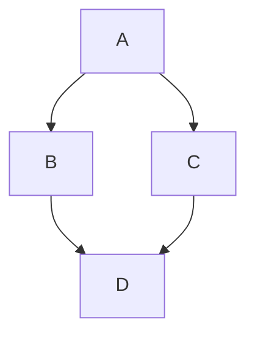

# Nucromuscular Juction

```mermaid
flowchart LR
  Define --> Ability to perform task in a given time sequence and the the extent that is appropriate for that task
```

Here is a simple flow chart:


